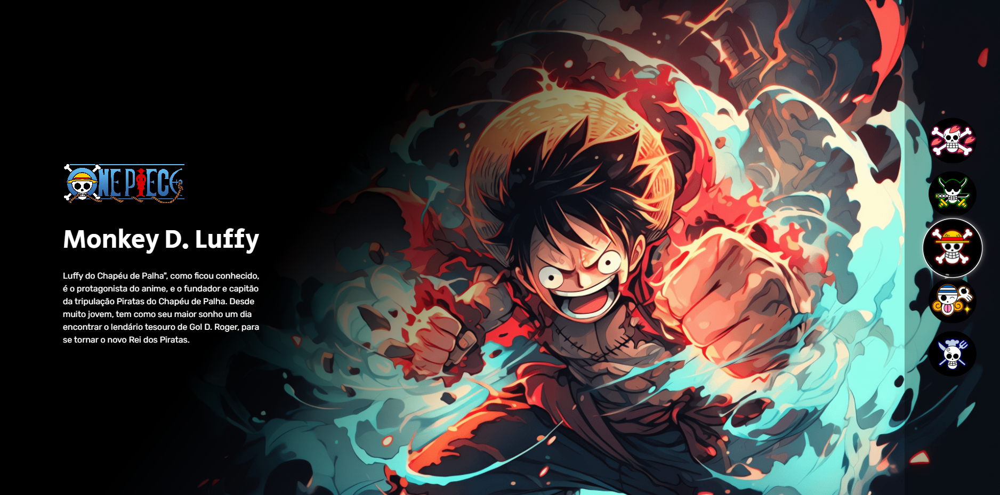

    

## 🖥️ Projeto One Piece do Dev em Dobro
Este é um projeto responsivo de uma página que você escolhe o personagem que deseja e sua descrição são exibidas na tela.

## 🧠 Lógica
O úsuario tem alguns "botões" que podem ser selecionados/clicados (pode interagir), ao selecinar a imagem do respectivo personagem é mostrado na tela, junto com suas descrições.

## 🚀 Tecnologias
Para este projeto ser desenvolvido, foram utilizadas as seguintes tecnologias:

-HTML
-CSS
-JAVASCRIPT

## 💮 
Eu por conta, resolvi fazer um README e adicionei um ":hover" no projeto, para que quando o usuário passar o mouse por cima do "botão" possa dar um pequeno zoom chamando a sua atenção para o personagem a ser cliclado.
E também coloquei em prática o pouco que aprendi até agora sobre o git.
